# ezJohap
ezJohap은 맥용 폰트 편집 프로그램인 [Glyphs](http://www.glyphsapp.com)에서 한글 조합형(composite) 폰트를 제작하는데 유용하게 사용할 수 있는 스크립트입니다.

현재는 전통적인 방식인 일반 조합요소를 이용한 한글 조합형 폰트 제작에 초점을 맞추어 제작되었으며, 업데이트를 통해 스마트컴포넌트를 이용한 한글 조합형 폰트 제작 기능과 기존의 조합룰 방식의 한글 조합형 폰트 제작 기능을 계획하고 있습니다.

## 기본 UI

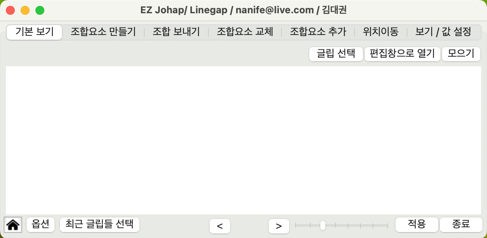

**기본 보기** : 조합요소 선택 시, 해당 조합요소를 사용하는 글립 미리보기

**조합요소 만들기** : 완성형 글립에서 선택한 요소를 조합요소로 만들면서 다른 한글에 조합요소로 붙여넣기

**조합 보내기** : 선택한 한글들의 조합데이터를 다른 글자들에 그대로 붙여넣기

**조합요소 교체** : 선택한 한글들의 조합요소를 초중종 타입에 따라 미리보면서 교체하기

**조합요소 추가** : 조합요소가 부족한 한글에 초중종 타입에 따라 미리보면서 조합요소를 추가하기

**위치이동** : 선택한 한글에서 조합요소의 위치 이동시키기

**보기 / 값 설정** :  
* 선택한 초중종 그룹에 따라 조합되는 한글 미리보기  
* width, height 값 설정 및 미리보기  
* 다양한 조건에 맞춰 글립들을 모아서 보기

## 1. 기본 보기
**폰트뷰에서 조합요소 선택 시** : 해당 조합요소 또는 글립을 사용하는 글립들 미리보기

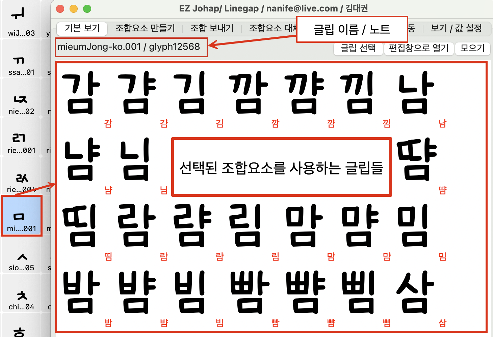  
<폰트 뷰에서 조합요소 선택 시, 해당 요소를 사용하는 글립들>

**편집창에서 조합요소 선택 시** : 해당 조합요소를 사용하는 글립들을 미리보기

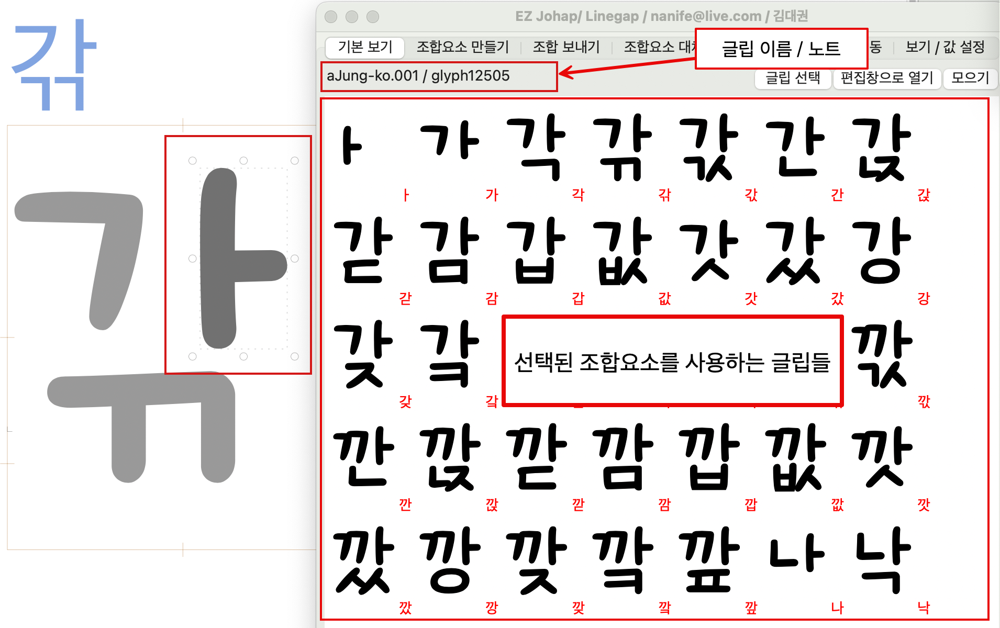  
<편집창에서 조합요소 선택 시, 해당 요소를 사용하는 글립들>

**편집창에서 여러 개의 조합요소 선택 시** : 여러 조합요소를 공통으로 사용하는 글립들을 미리보기

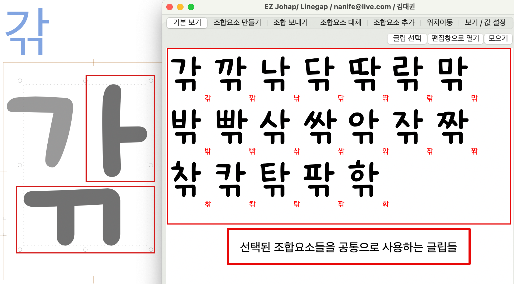  
<편집창에서 여러 개의 조합요소 선택 시, 해당 요소를 공통으로 사용하는 글립들>

## 2. 조합요소 만들기
패스로 구성된 글립에서 특정 영역을 조합요소로 변환(생성)하면서 다른 글자들에도 조합요소로 입력해서 보내는 기능

### 1) 편집창에서 조합요소 만들기
편집창에서 조합요소로 변환하고 싶은 패스를 선택하고 해당 조합요소를 어느 글자들에 보낼지 선택하는 방식으로 조합요소 생성 및 조합요소 보내기를 한번에 할 수 있음

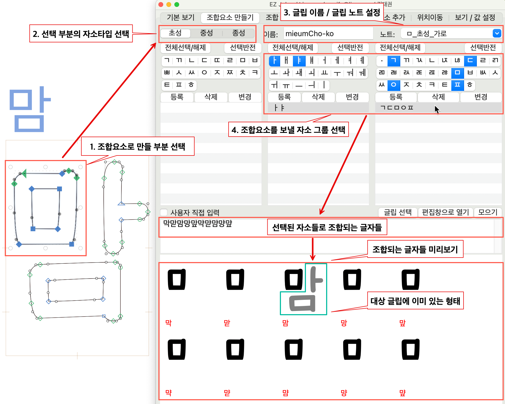  
<편집창에서 특정 영역을 선택해서 조합요소로 변경하고 다른 글자에도 조합요소로 입력하기>

**1. 조합요소로 만들 부분 선택** : 조합요소로 만들 패스(들) 선택하기

**2. 선택 부분의 자소타입 선택** : 조합요소로 만들 부분이 초, 중, 종성 중 어떤 자소타입인지 선택하기

**3. 글립 이름 / 글립 노트 설정** : 조합요소의 이름 및 노트를 설정  
* 조합요소의 이름이 'mieumCho-ko.001' 이라고 할 필요 없고 'mieumCho-ko'라고 입력하면 됨(뒤쪽에 오는 '.001', '.002', '.003' 등은 자동으로 계산)  
* 조합요소의 글립노트는 조합요소의 용도를 위해 본인이 원하는 값을 입력하면 됨(마찬가지로 뒤쪽에 오는 '.001', '.002', '.003' 등은 자동으로 계산)  
* 글립노트는 필요치 않을 경우 넣지 않아도 됨  
* 한글에서 조합요소 생성을 위해 자소타입을 선택하면, 해당 자소타입을 토대로 자동으로 자소의 이름과 자소 노트를 생성함

**4. 조합자소를 보낼 자소 그룹 선택** : 선택한 자소와 결합되어지는 다른 자소타입의 자소들을 선택하기  
* 선택한 부분의 자소타입을 선택할 필요 없이 나머지 자소타입의 자소들만 선택하면 됨

* 초, 중, 종 선택한 자소들로 조합되는 글자들이 입력창에 보여짐(사용자 직접 입력 입력 시, 선택된 자소들의 조합을 무시)
* 조합된 글자들 미리보기 시, 대상 글립에 이미 있는 부분은 회색으로 보여짐  
*  조합자소를 만들면, 설정된 글립 이름과 글립노트를 토대로 자동으로 인덱스를 계산해서 조합요소를 생성함

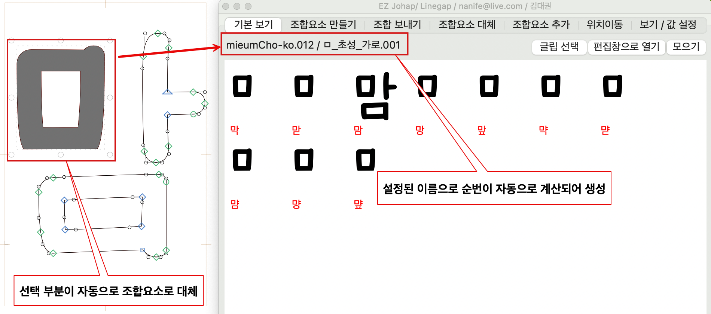  
<편집창의 선택 부분이 조합요소로 대체된 모습>  

### 2) 폰트뷰에서 조합요소 선택해서 조합요소 보내기  
조합요소가 이미 있다면 폰트뷰에서 조합요소를 직접 선택해서 한글에 바로 조합요소로 보낼 수도 있음 : 이 경우, 조합요소가 새롭게 생성되지는 않음  
* 보낼 요소의 글립이름이 초, 중, 종 자소의 이름(ex: pieupCho-ko.001)으로 시작하면 자동으로 자소타입을 계산하고, 선택한 글립의 이름과 노트를 채워서 보여줌

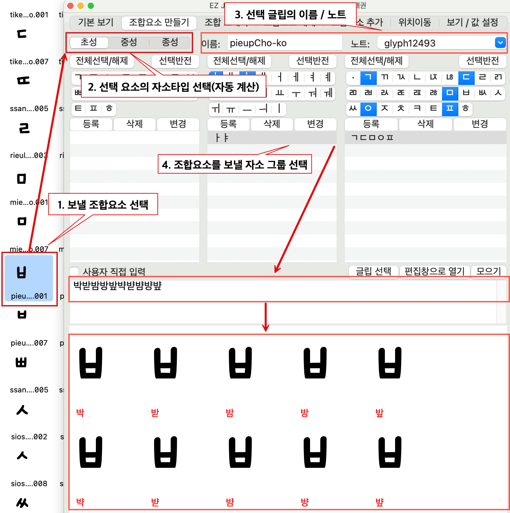  
<폰트뷰에서 조합요소를 다른 글자들에 보내는 모습>

### 3) 주의
만일 대상 글립들에 이미 같은 자소타입의 조합요소가 있으면 현재 붙여넣는 요소로 대체(예: '막'의 초성이 조합요소로 이미 존재하는 상황에서 '맘'의 초성을 '막'에 조합요소로 보내면 '막'의 초성 ㅁ은 '맘'의 초성 ㅁ으로 대체됨)

## 3. 조합 보내기
이미 조합이 완성된 글립들을 선택해 다른 글자들에 조합데이터를 붙여넣는 기능(단, 바꿀 자소타입에 대해서는 조합룰을 붙여넣을지 여부 결정)

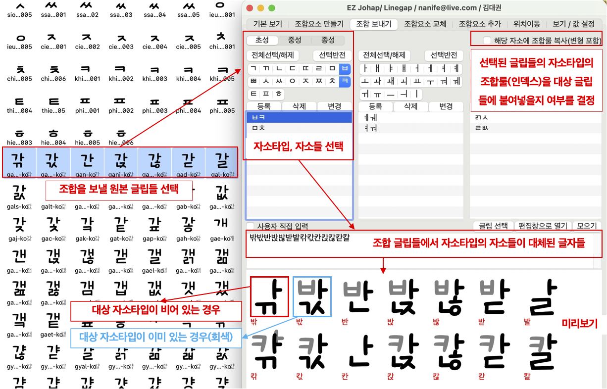  
<선택된 글립들의 조합요소를 다른 글자들에 보내기>  

### 1) 원본 글립 선택
조합요소를 보내기 위해서는 대상 자소타입에 대해서는 1개의 자소만 선택해야 함  
예) 초성을 대체해서 붙여넣기 위해서는 선택한 글립들에 대한 초성이 모두 동일해야 함(즉, '감', '남'을 선택하면 중성과 종성이 2개 글자에 모두 있으니 어떤 글자에서 가져갈지 선택할 수 없음)

### 2) 자소타입에 대한 조합룰 복사
**a. 자소타입에 해당하는 조합룰 복사 안함** : 대상 자소타입을 제외한 나머지 자소타입들의 조합데이터만 붙여넣기 됨(예: 초성 자소타입 선택 시, 선택 글립들의 중성과 종성만 대상 글립들에 붙여넣기 됨)  
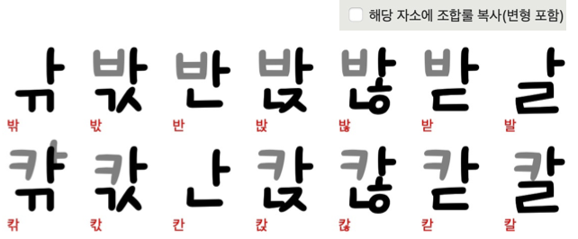  
<선택된 자소타입의 조합데이터를 덮어쓰지 않은 상태 : 다른 자소타입만 덮어씀>  

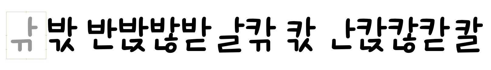  
<선택된 자소타입의 조합데이터를 덮어쓰지 않은 결과>  

**b. 자소타입에 해당하는 조합요소가 이미 존재할 경우** : 대상 조합요소를 삭제하고, 현재 복사하는 원본 글립의 자소타입에 해당하는 조합데이터(인덱스, 변형 데이터)로 대체. 단, 선택된 자소타입에 해당하는 자소로 자동 대체

**c. 자소타입에 해당하는 조합요소가 없을 경우** : 현재 글립의 선택 자소타입의 조합데이터가 붙여넣기 됨. 이 때, 선택된 자소타입에 해당하는 자소로 자동 대체(만약 대상 자소가 없으면, 조합데이터만 추가)  

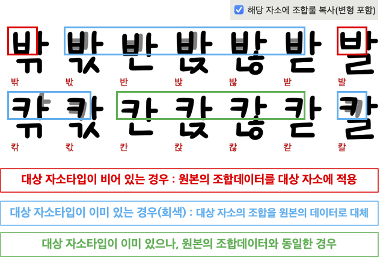  
<선택된 자소타입의 조합데이터를 대상 자소에 덮어쓴 상태 : 선택 자소타입 데이터 적용>  

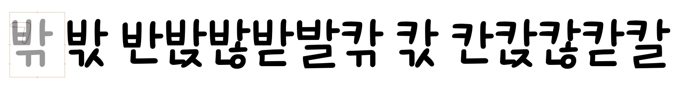  
<선택된 자소타입의 조합데이터를 대상 자소에 덮어쓴 결과>  

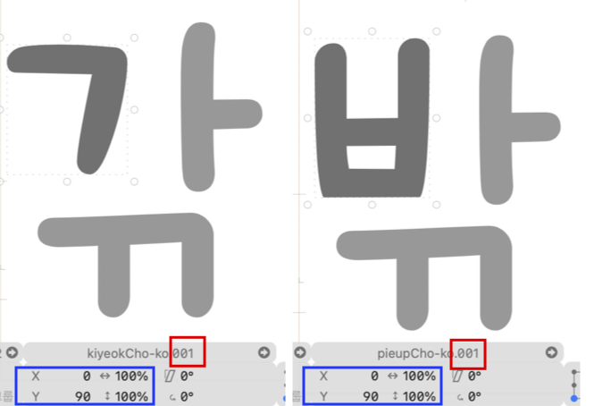  
<선택된 자소타입의 조합데이터를 대상 자소에 덮어쓴 결과 : 자소의 인덱스와 변형 데이터가 동일>  

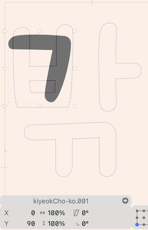  
<선택된 자소타입의 조합요소가 백그라운드에 자동 추가됨>  

### 3) 조합 작업 방식  
**a. <조합요소 만들기> 기능을 이용해 조합을 채워 나가는 방식** : ㅁ 계열의 기본 모듈 계열의 글자들을 먼저 그린 후, 각 초, 중, 종 자소를 조합요소로 만들면서 다른 글자들에 보낸다. 이후,, 조합요소가 부족한 글립들을 찾아서 부족한 요소를 그려서 다시 다른 글자들에 조합요소로 보내는 방식을 반복하는 방식  
* 예) **맘** (초,중,종 자소를 조합요소로 만들기) -> **맏**(마 부분은 맘의 초,중성으로 채워짐 : 종성 ㄷ 그려서 다른 글립들에 조합요소로 보내기) -> **맢**(마 부분은 맘의 초, 중성으로 채워짐 : 종성 ㅍ 그려서 다른 글립들에 조합요소로 보내기) -> ... -> **암** (중, 종성은 맘에서 조합요소로 채워넣음 : 초성 ㅇ 그린 후, 다른 글립들에 조합요소로 보내기)

**b. <조합요소 만들기> 기능과 <조합 보내기> 기능을 혼합 사용하는 방식** : 조합요소 만들기 기능을 이용해 1개 초성 모듈(예: ㅁ 계열)을 모두 완성한 후, 조합 보내기 기능을 이용해 다른 글자들에 붙여넣고 부족한 자소를 다시 채워나가는 방식  
* 예) **ㅁ 계열** (조합요소로 모두 채움) -> **ㅇ 계열** (ㅁ 계열에서 조합 보내기 후, 초성 ㅇ을 조합요소 만들기 처리) -> **ㅂ 계열** (ㅁ 계열에서 조합 보내기 후, 초성 ㅂ을 조합요소 만들기로 처리, ) -> ...  

## 4. 조합요소 교체
선택한 한글들의 공통적인 조합요소들의 인덱스를 한번에 다른 인덱스로 교체하는 기능으로 원본의 첫번쨰 글립과 대치할 조합요소를 적용한 결과를 미리보기를 통해 비교하면서 조합요소 선택가능

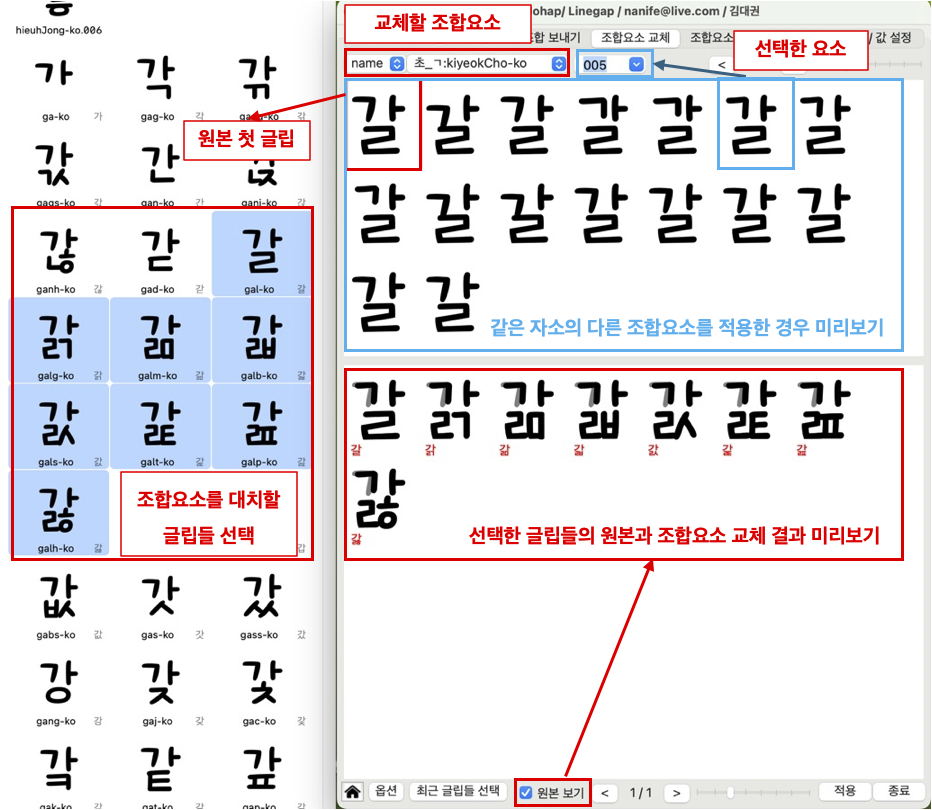  
<선택한 글립들의 조합요소를 대치해서 미리보기(원본과 같이 보기)>  

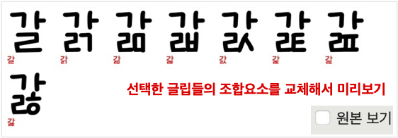  
<선택한 글립들의 조합요소를 대치해서 미리보기(적용된 결과만 보기)>  

## 5. 조합요소 추가
선택한 한글들에 공통적으로 없는 조합요소를 추가하는 기능으로, 조합요소를 추가한 모습을 미리보기하면서 적용 가능 : 만약 이미 추가할 조합요소가 있을 경우에는 조합요소를 대체해 줌

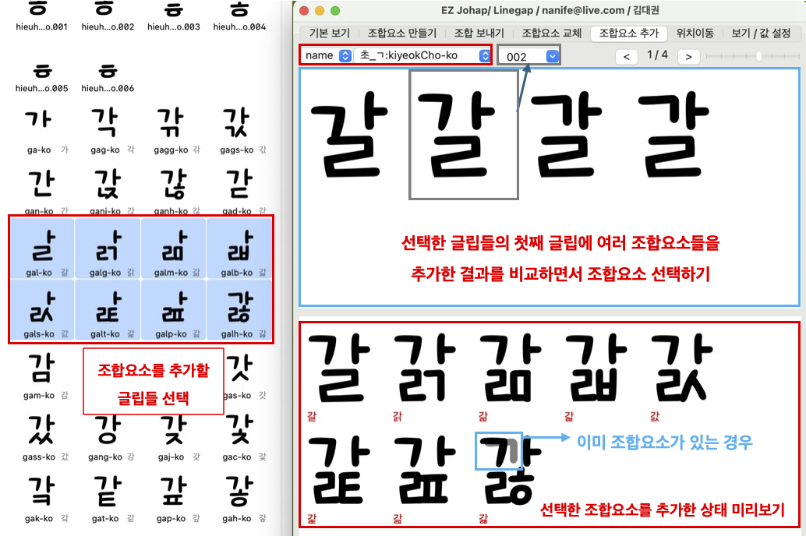  
<조합요소를 추가한 모습을 미리보기하면서 요소 선택하기>  

## 6. 조합요소 이동
조합요소의 위치가 어울리지 않을 때 여러 글자들에 공통적으로 있는 조합요소를 한번에 쉽게 이동하는 기능

**현재 위치 기준** : 조합요소가 이미 이동된 현재 상태를 기준으로 이동할지, 현재의 위치를 무시하고 원본 조합요소의 위치를 기준으로 이동할지 결정할 수 있음  
**이동 값 설정 및 키보드로 이동** : 작은 값은 'option'키를, 큰 값은 'shift' 키를 방향키와 같이 조합해 이동 가능

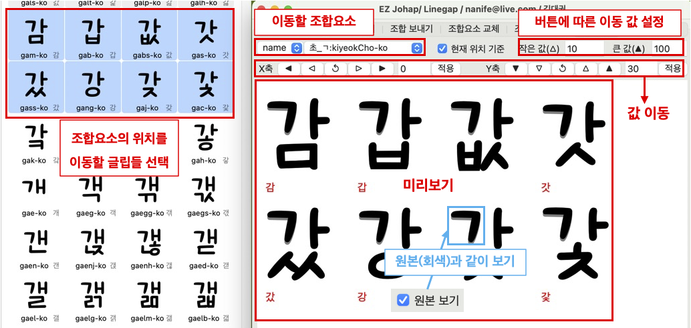  
<조합요소의 현재 위치를 기준으로 위치를 이동한 모습(원본과 비교)>  

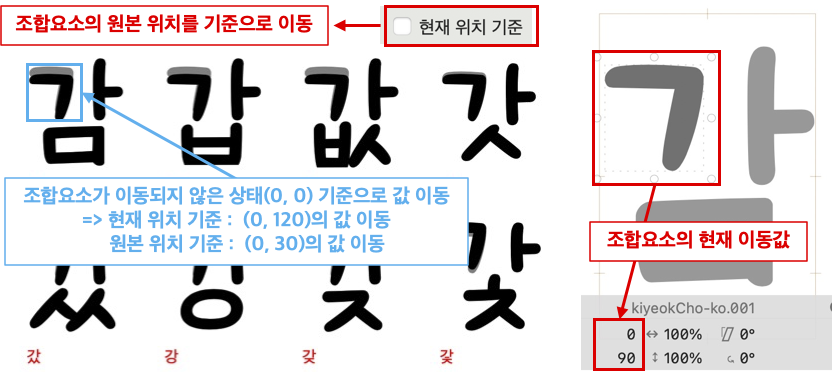  
<조합요소의 현재 위치를 무시하고 원본을 기준으로 위치를 이동한 모습(원본과 비교)>  

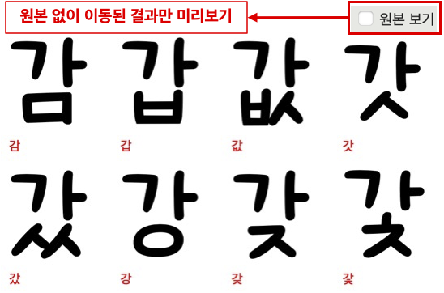  
<조합요소의 위치를 이동한 결과를 원본과 비교하지 않고 미리보기>  

## 7. 보기 / 값 설정
자소 선택으로 조합되는 한글을 미리보기 / 글립 width 또는 height 설정 / Metrics 조건에 맞는 글립 찾기 / 다양한 옵션에 맞는 글립 찾기 등

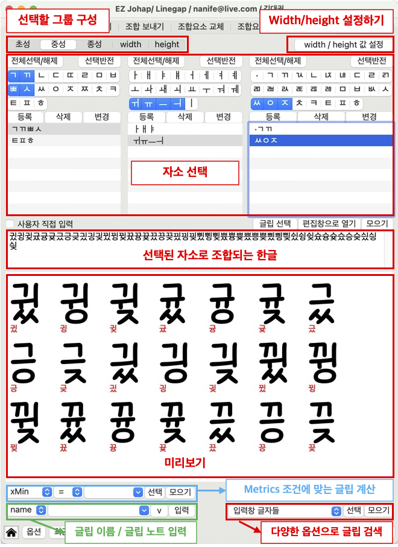  
<자소 선택을 통해 조합되는 한글 미리보기(중성 그룹 선택을 통한 단순 미리보기 예)>  

### 1) 자소 선택으로 보기
초성, 중성, 종성, width, height 그룹 중 원하는 그룹을 선택해 각 자소들을 선택함으로써 조합되는 글자들을 미리보기하는 기능

**초성, 중성, 종성 그룹** : 단순 미리보기 기능  
**width, height 그룹** : width, height 그룹의 자소들을 선택해 width 또는 height를 미리보기하는 기능

### 2) width / height 설정
width / height 그룹에서 설정한 조합을 토대로 width 또는 height를 설정하는 기능

**a. 그룹 설정** : width, height를 설정하기 전에 빠지는 자소가 없도록 그룹 설정 필요

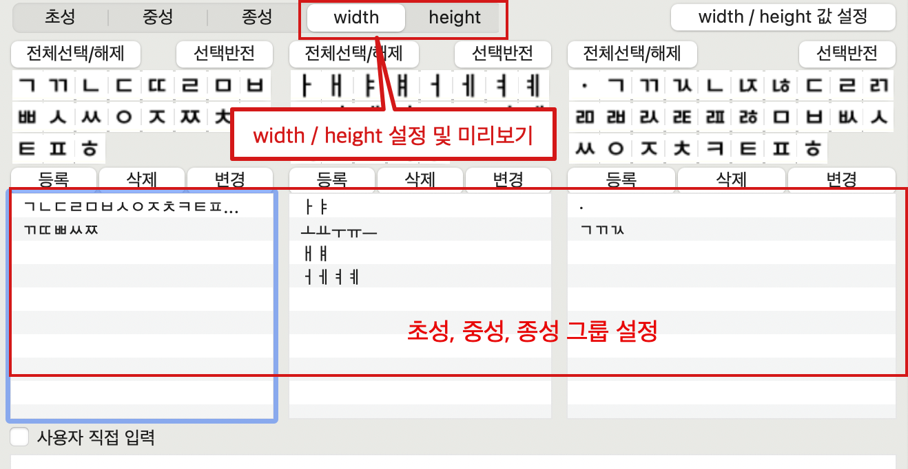  
<width, height 설정을 위한 그룹 설정>  

**b. width 설정** : 설정한 width 그룹의 초, 중, 종 서브 그룹을 불러와 조합되는 글자들을 계산하며 width 값 설정  
* 값을 쉽게 설정할 수 있도록 그룹(행,열)을 선택 가능  
* 설정할 수 있는 값 : 절대값 / 중성 xMax 값 기준 + 추가 값 / 글립의 xMax 값 기준 + 추가 값

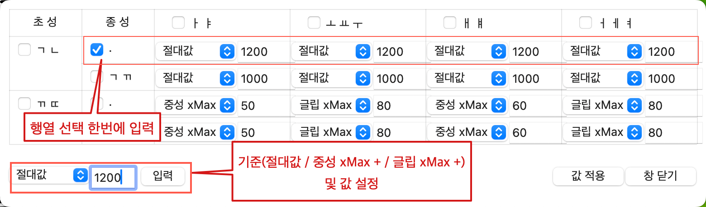  
<설정된 width 그룹을 불러와 width를 설정하는 모습>  

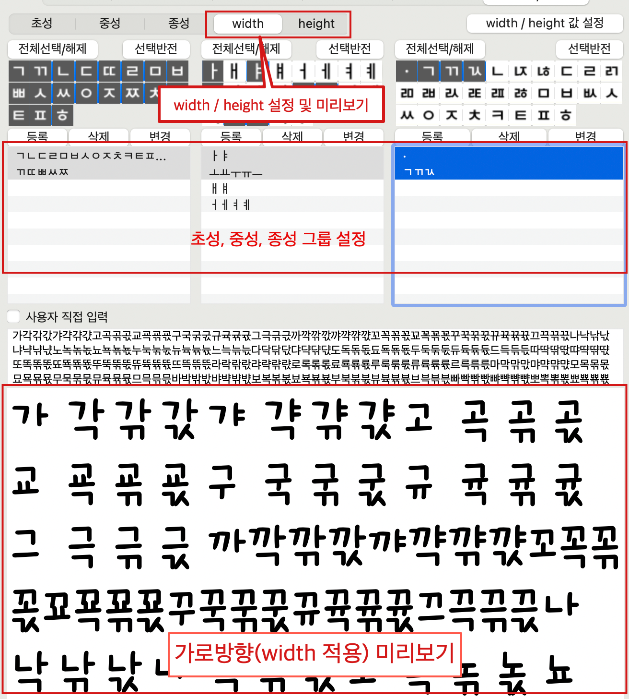  
<width 설정 후, 자소를 선택해 width값의 적용 미리보기>  

**c. height 설정** : 설정한 height 그룹의 초, 중, 종 서브 그룹을 불러와 조합되는 글자들을 계산하면서 height 값 설정(세로쓰기를 위한 용도)  
* 값을 쉽게 설정할 수 있도록 그룹(행, 열)을 선택 가능
* 설정할 수 있는 값 : 절대값 / yMin 값 기준 - 추가 값  

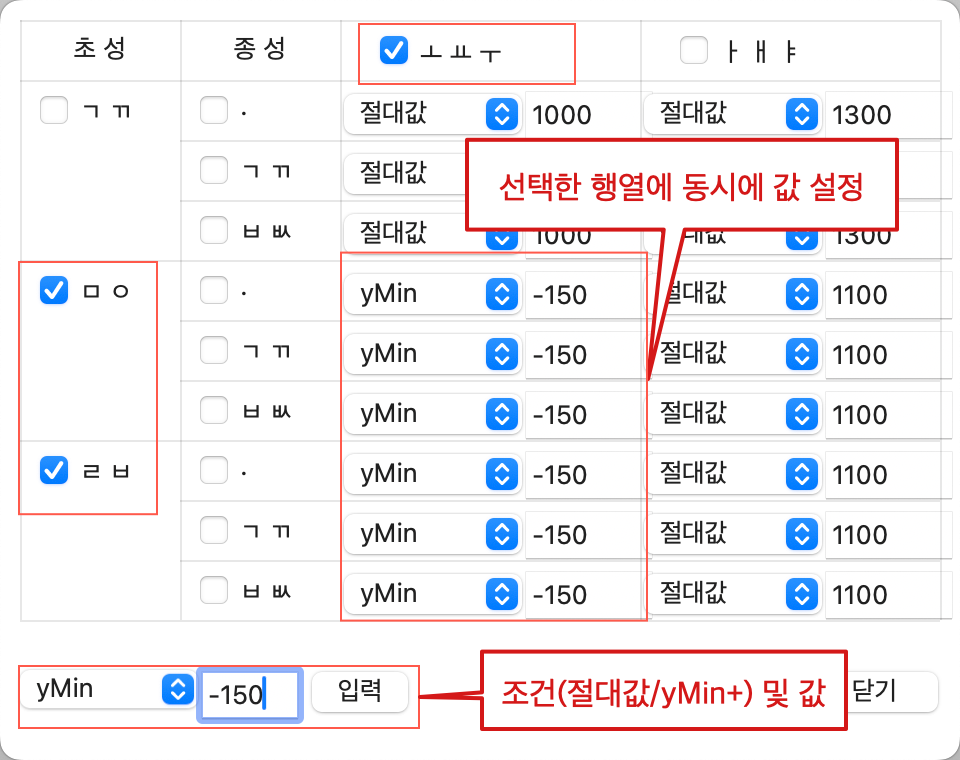  
<설정된 height 그룹을 불러와 height를 설정하는 모습>  

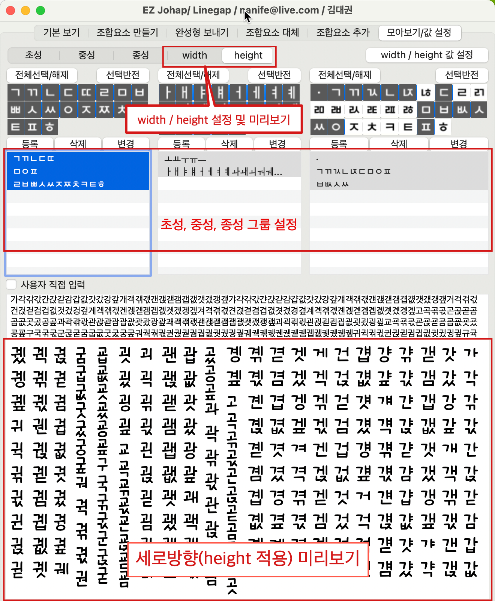  
<height 설정 후, 자소를 선택해 적용된 height값의 적용 미리보기>  

### 3) 선택 / 모으기
다양한 조건을 설정한 후, 조건에 맞는 글립들을 찾는 기능 : 1개 이하를 선택하면 전체 글립을 대상으로 하며, 2개 이상의 글립을 선택하면 선택한 글립 내에서만 검색 처리    

**주의** : "모으기" 기능은 많은 글립들을 대상으로 할 때 시간이 오래 걸릴 수 있음

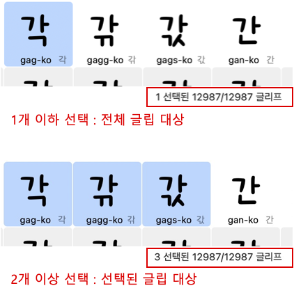  
<선택된 글립 수에 따른 검색 대상 글립 수량>  

**a. 메트릭스(Metrics) 검색** : xMin, xMax, width, yMin, yMax, height, LSB, RSB 값을 입력된 값과 비교한 결과에 해당하는 글립들 찾기  
* 비교 값 : 값을 선택(ascender, descender, 0, upm)하거나 직접 입력  

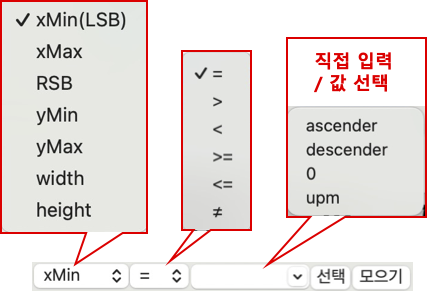  
<메트릭스를 조건으로 검색하기>  

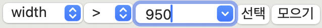  
<옵션 예 : xMin 값이 950보다 큰 글립들을 검색>  

**b. 글립 이름 / 글립 노트 설정** : 선택된 글립들에 대한 글립 이름 또는 글립 노트를 설정하는 기능으로, 선택된 글립들을 한번에 순차적으로 설정할 수 있음

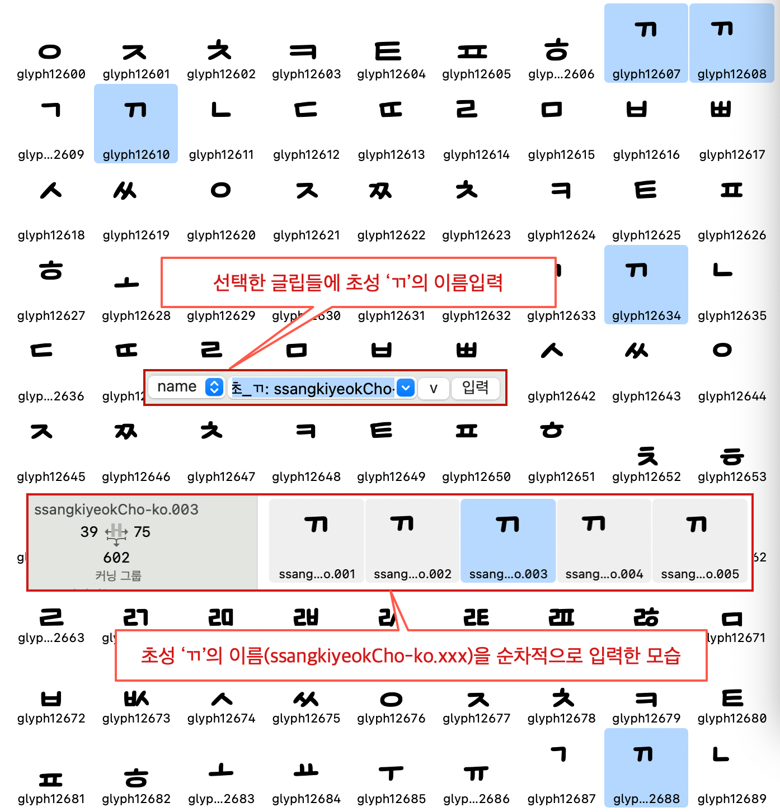  
<선택된 글립들에 글립 이름을 순차적으로 입력한 모습>  

**c. 글립 검색** : 다양한 옵션을 이용해 조건에 맞는 글립들을 검색하는 기능

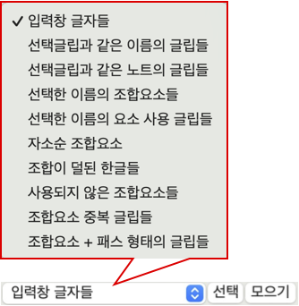  
<글립을 찾기위한 검색 조건들>  

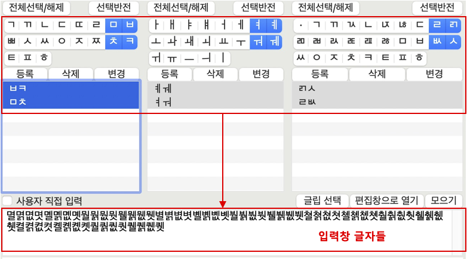  
<입력창 글자들>  

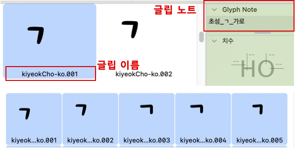  
<선택한 글립과 이름/노트가 같은 글립들>  

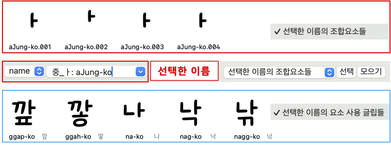  
<선택한 글립이름을 갖는 조합요소들 / 해당 이름의 조합요소를 갖는 글립들>  

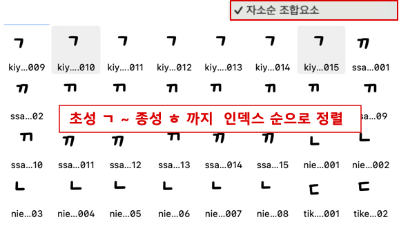  
<조합요소를 초성 ㄱ 부터 종성 ㅎ까지 정렬된 상태로 모으기>  

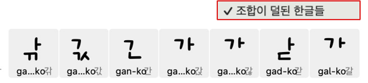  
<초중종 조합요소 중 하나라도 누락된 한글 검색>  

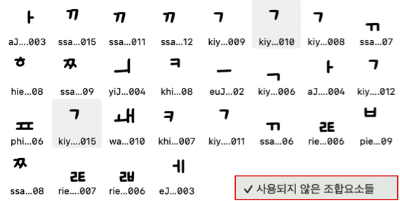  
<다른 글립에서 조합요소로 사용하지 않는 조합요소들>  

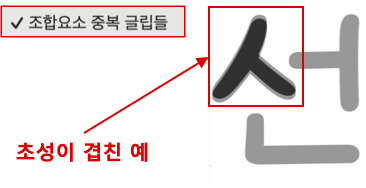  
<조합요소가 겹친 글립 예>  

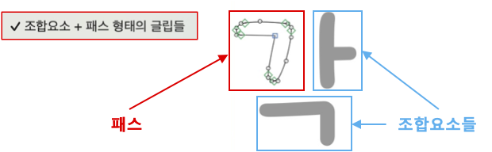  
<조합요소와 패스가 같이 있는 글립 예>  

## 8. 기타 기능들
### 1) 그룹 설정
**등록** : 선택한 자소들을 그룹으로 만들기 : 자소 선택 후, '등록' 버튼 누름

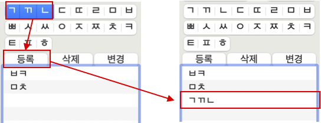  
<선택한 자소들을 그룹으로 등록하기>  

**삭제** : 선택한 그룹들을 그룹목록에서 삭제: 삭제할 그룹 선택 후 '삭제' 버튼 누름

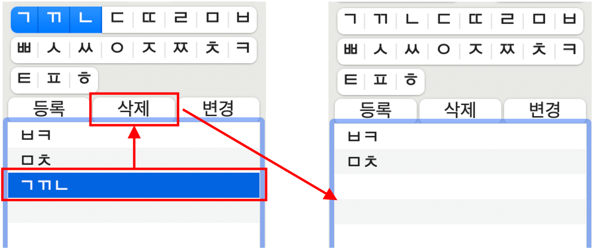  
<선택한 그룹을 그룹목록에서 삭제하기>  

**변경** : 선택한 그룹들을 합치거나, 자소를 추가 또는 삭제 : 그룹 선택 후 '변경' 버튼 누름 / 그룹 선택 후에 자소 변경하고 '변경' 버튼 누름

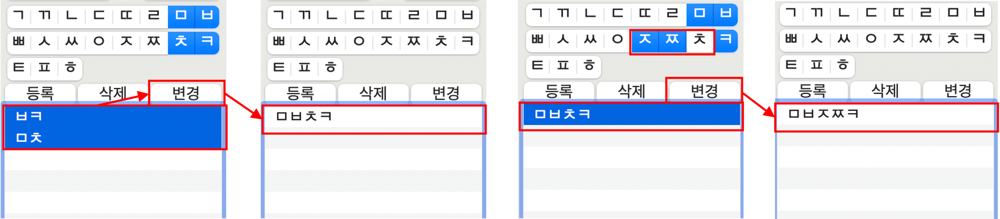  
<선택한 그룹의 구성을 변경하기 (그룹 합치기 / 자소 변경)>  

**전체 선택 / 전체 선택 취소** : 자소들 전체를 선택하거나 선택해제하기
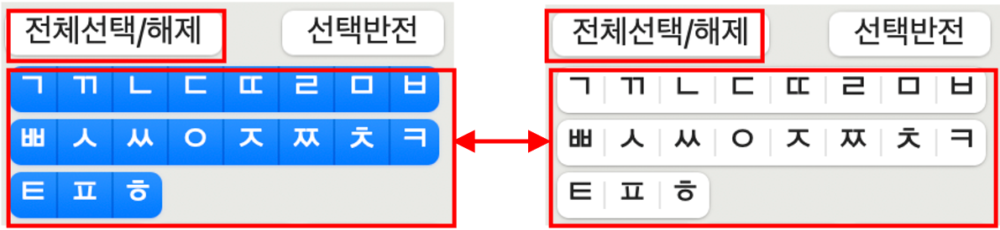  
<자소들 전체를 선택하거나, 모든 선택된 자소들을 해제하기>  

**선택 반전** : 자소들의 선택 상태를 반전(선택 <-> 해제)시키기
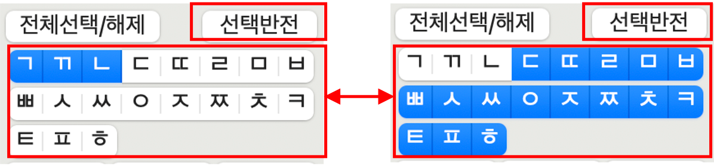  
<자소들의 선택 상태를 반전시키기>  

### 2) 글립 선택 / 열기 / 모으기
검색 또는 조건에 맞는 글립들을 용도에 맞게 작업하기 편하도록 설정해주는 기능 / 이전에 조합요소를 추가하거나 변경 또는 변형한 글립들을 다시 선택하는 기능

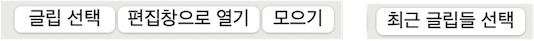  
<글립 선택, 편집창으로 열기, 모으기, 최근 글립들 선택 버튼들>  

**글립선택** : 조건에 맞는 글립들을 폰트뷰에서 선택된 상태로 만들기 : 더블클릭하면 편집창으로 열 수 있음  
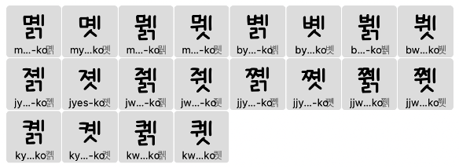  
<글립들을 폰트뷰에서 선택한 상태>

**편집창으로 열기** : 조건에 맞는 글립들을 편집을 위해 편집창으로 열기  
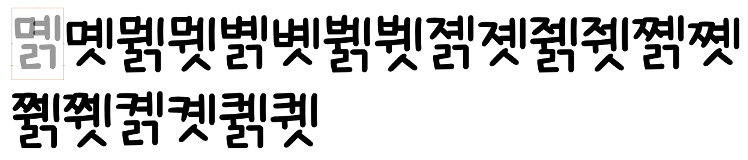  
<글립들을 편집창에서 열어놓은 상태>

**모으기** : 조건에 맞는 글립들 또는 검색된 결과를 폰트뷰에서 모아보기 : 임시 작업을 위해 모아 놓은 기능으로 원상태로 되돌리기 위해서는 다른 카테고리를 누르면 됨

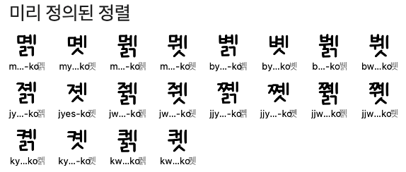  
<글립들을 폰트뷰에서 모은 상태>

**최근 글립들 선택** : 조합요소를 추가, 변경, 이동 등의 명령을 실행했다가 취소시키고자 할 경우 일일이 다시 선택하기에 어려움이 있는데, 이를 다시 선택할 수 있도록 하는 기능
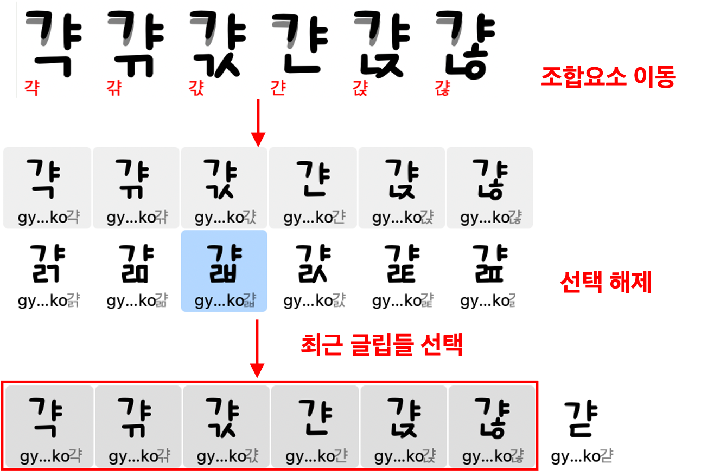  
<조합요소 변경 후, 이전 작업했던 글립을 다시 선택한 모습>

### 3) 보기(페이지 이동 / 확대, 축소)
**페이지 이동** : '현재 페이지 / 전체 페이지' 형태로 보여지며, '이전 페이지' 또는 '다음 페이지'로 페이지를 이동할 수 있음  
**확대, 축소** : 각 뷰(미리보기)마다 스케일 조정을 통해 크기를 조절할 수 있음  
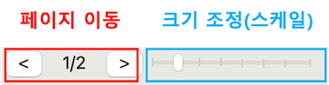  
<페이지 이동 및 크기 조정>

### 4) 옵션
**글립 배경색** : 흰색 바탕 + 검은색 글립 / 검은색 바탕 + 흰색 글립 형태로 배경색 바꾸기  
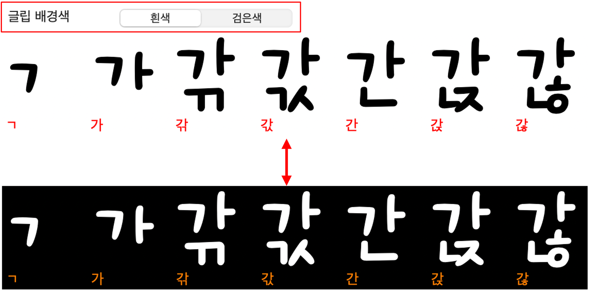  
<배경색 바꾸기 옵션 적용>

**작업 모드** : 패스 선택 후 '조합요소 만들기' 적용 시, 조합요소로 넣을지 아니면 패스를 붙여넣을지 설정
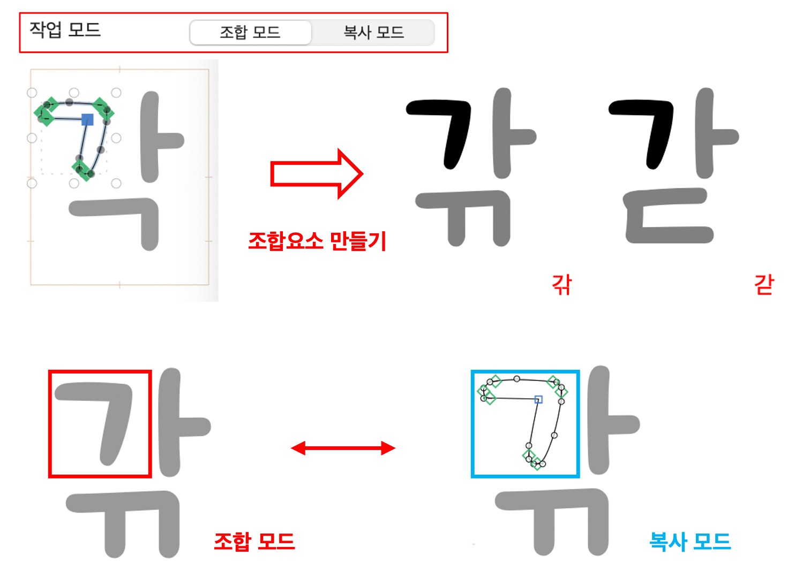  
<작업 모드 옵션 적용>

**글자 보이기** : 미리보기 창에서 글립에 해당하는 글자를 보일지 말지 여부 설정
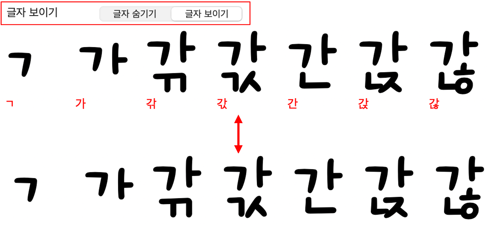  
<글자 보이기 옵션 적용>

**글자 위치** : 미리보기 창에서 글자의 위치를 변경(글립의 왼 쪽 아래 <-> 글립의 오른 쪽 아래)  
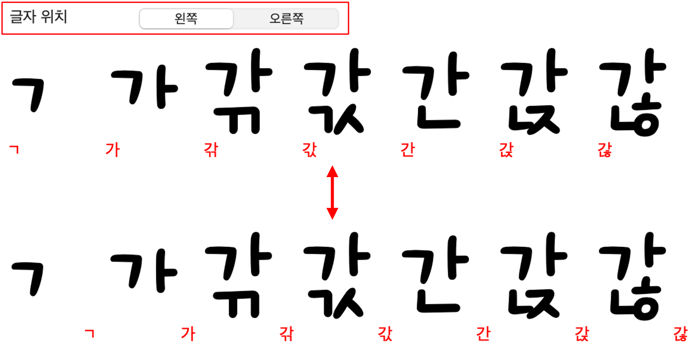  
<글자의 위치 변경 옵션 적용>
